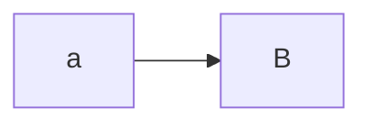
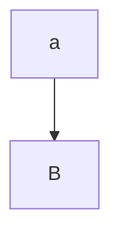
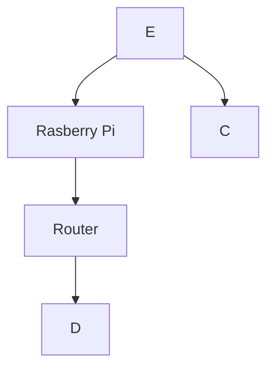

# EGL315

## name
William

*william*

**William**

***William***

## School
There are two options to insert code block

### Code Block
```

I am at Nanyang Polytechnic 
Block S 
room 540
```

### Code Line
`sudo raspi-config`

## Adding Picture
DFT1 PROJECT


## Block Diagram

LEFT TO RIGHT

TOP TO DOWN

